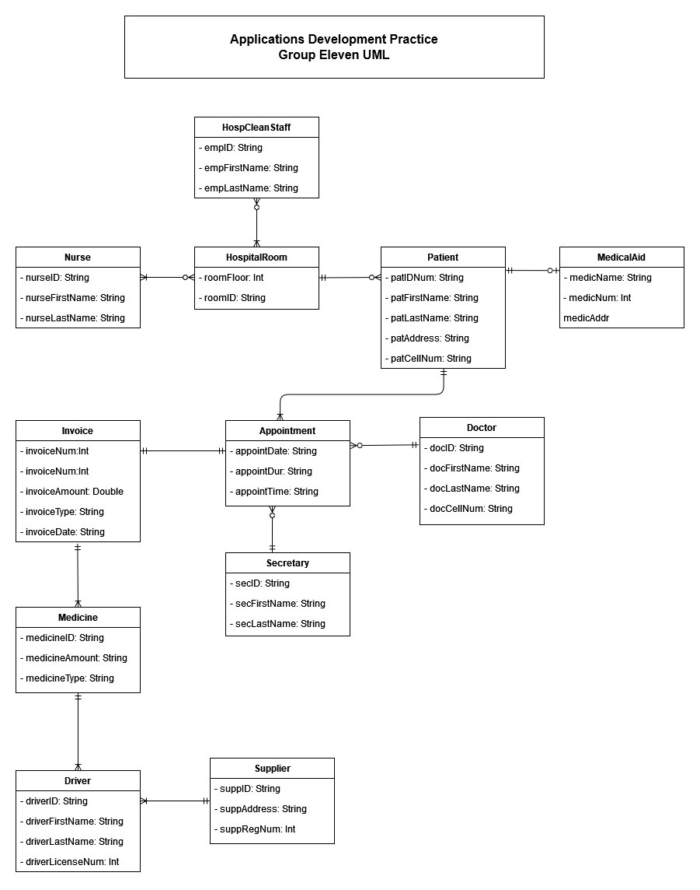

# Applications Development Practice 3
## Hospital Management System
### AppDevPrac Group Eleven 

Entities are as follows:  
-Doctor  
-Driver  
-Nurse  
-Patient  
-Cleaning Staff  
-Medical aid  
-Secretary  
-Supplier  
-Hospital Room  
-Medicine  
-Appointment  
-Invoice  

Group members entity assignment is as follows:  
-Sine: Doctor & Secretary  
-Nonzwakazi: Driver & Supplier  
-Fayaad: Nurse & Hospital room  
-Ishmail: Patient & Medicine  
-Sinazo: Cleaning staff & Appointment  
-Shina: Medical aid & Invoice

